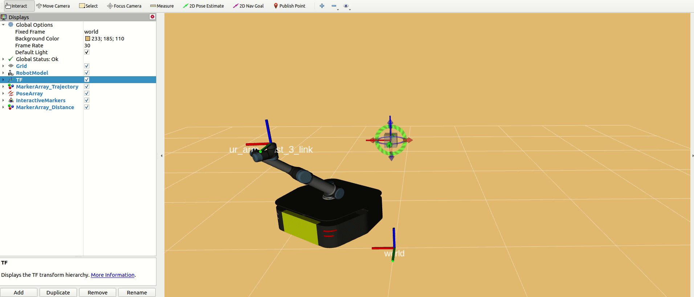

# Mobile-Manipulator_MPC_OCS2

基于非线性模型预测控制 (Nonlinear Model Predictive Control, NMPC) 的移动机械臂 (Mobile Manipulator) 全身运动规划与控制

开关系统最优控制 (Optimal Control for Switched Systems, OCS2) 里实现“机械臂末端控制”的核心，不是直接把末端位姿当作系统状态来闭环，而是：

- 用 `ocs2_mobile_manipulator` 建立一个移动底盘 + 机械臂关节的运动学模型
- 用 `Pinocchio` 根据系统状态实时计算末端执行器位姿
- 把“末端期望位姿”写成 `TargetTrajectories`
- 在 OCS2 的最优控制问题里，用 `EndEffectorConstraint` 把“当前末端位姿 - 目标末端位姿”的误差写成 6 维软约束
- 最后通过 MPC 联合优化底盘速度与机械臂关节速度，让末端执行器跟踪目标位姿

## 移动机械臂末端执行器移动至目标点

```bash
cd ~/OCS2_ws
source ./devel/setup.bash
roslaunch ocs2_mobile_manipulator_ros manipulator_ridgeback_ur5.launch
```

随后拖动 Rviz 中的交互对象，右键发送目标，移动机械臂即可实现跟随


